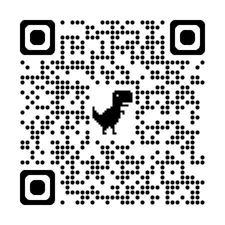

# chien-saisei-camera（体育授業用 遅延再生カメラ PWA 対応版）
https://harmoniaepic.github.io/chien-saisei-camera-pwa/



上記リンク先を開くか、上記QRコードを読み取ってご使用下さい。

体育の授業で動きを確認するための遅延再生アプリです。生徒が自分の動きをその場で確認できるよう、最大90秒の遅延再生機能を提供します。[PWA（Progressive Web App）](https://ja.wikipedia.org/wiki/%E3%83%97%E3%83%AD%E3%82%B0%E3%83%AC%E3%83%83%E3%82%B7%E3%83%96%E3%82%A6%E3%82%A7%E3%83%96%E3%82%A2%E3%83%97%E3%83%AA)対応で、スマートフォンやタブレットにインストールして使用できます。

# 使い方紹介

## 🌟 主な機能

- **遅延再生**: 1〜90秒の範囲で自由に設定可能
- **複数カメラ対応**: デバイスに接続された複数のカメラを切り替え可能
- **高画質録画**: 720p/1080pの解像度選択
- **ライブビュー**: ライブ映像と遅延再生映像の同時表示
- **PWA対応**: オフラインでも動作し、ホーム画面に追加可能
- **メモリ管理**: 自動的にメモリ使用量を監視し、必要に応じてバッファをクリア

## 🚀 使い方

### オンラインで使用
1. https://harmoniaepic.github.io/chien-saisei-camera-pwa/ にアクセス
2. カメラへのアクセスを許可
3. 遅延時間を設定して「録画開始」をタップ

## 📱 アプリとしてインストール

インストールしてオフラインで使えます。ブラウザでアクセス後、「アプリをインストール」ボタンをクリックするか、ブラウザのメニューから「アプリをインストール」を選択してください。

- [Chrome でのインストール方法詳細](https://support.google.com/chrome/answer/9658361?hl=ja)
- [Edge でのインストール方法詳細](https://learn.microsoft.com/ja-jp/microsoft-edge/progressive-web-apps/ux)
- [MDN での PWA 解説](https://developer.mozilla.org/ja/docs/Web/Progressive_web_apps/Guides/Installing)

## 🏫 授業での活用例

- **体操・ダンス**: フォームの確認と修正
- **球技**: 投球・打撃フォームのチェック
- **陸上競技**: スタートダッシュや跳躍の動作分析
- **武道**: 型や技の確認

## 🛠️ 技術仕様

- **フレームワーク**: バニラJavaScript（外部ライブラリ不要）
- **録画方式**: MediaRecorder API + MediaSource APIによるバッファ方式
- **対応ブラウザ**: Chrome, Edge, Safari（iOS 14.5+）
- **必要な権限**: カメラアクセスのみ

## 📱 動作環境

- スマートフォン、タブレット、PC
- HTTPS環境（PWA機能のため必須）
- 十分なメモリ（長時間の遅延再生には多くのメモリが必要）

## 🔧 セットアップ（開発者向け）

### GitHub Pagesでの公開
1. このリポジトリをフォーク
2. Settings → Pages → Source を "Deploy from a branch" に設定
3. Branch を main に設定して Save
4. `https://[username].github.io/[repository-name]/` でアクセス可能

### ローカル開発（参考）
```bash
# HTTPSサーバーが必要（PWA機能のため）
npx http-server -S -C cert.pem -K key.pem
```

## 📝 ライセンス

MIT License - 詳細は [LICENSE](LICENSE) ファイルを参照

## 🤝 貢献

Issue報告やPull Requestを歓迎します。

## 👤 作者

HarmoniaEpic
